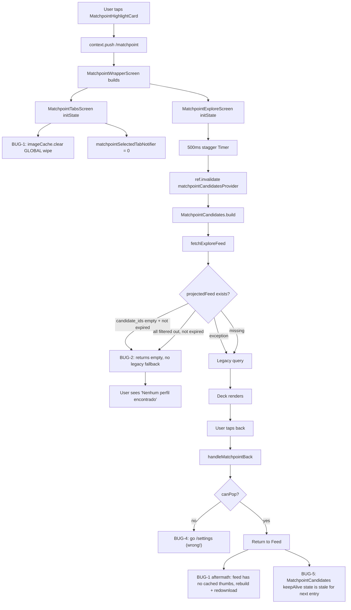

# Matchpoint — Fix the "breaks the app after the move to a card" regression

Date: 2026-04-09

## Context

MatchPoint was originally a bottom-nav tab. It was relocated to be a highlight card rendered on the Feed (`lib/src/features/feed/presentation/feed_screen_ui.dart:91`) and on Settings (`lib/src/features/settings/presentation/settings_screen.dart:66`), both pushing the top-level `RoutePaths.matchpoint` route that renders `MatchpointWrapperScreen` (outside the `StatefulShellRoute.indexedStack` in `lib/src/routing/app_router.dart:534-549`).

Since that move, entering or returning from the feature visibly "breaks the app": thumbnails/avatars in the parent screen reload every time you come back, the deck shows empty state when it should not, and the back button sometimes lands on Settings even though you came from Feed. Under the hood, the git log (`1.6.4..1.6.31`) shows **24+ consecutive releases** patching the feature for iOS Swift-Concurrency SIGABRTs, empty feeds, swipe timing, and navigation — each adding layers of defensive code without unwinding the root causes.

The scope of this plan is: **fix the user-visible breakage introduced by the relocation and remove the defensive code that now makes things worse**. It does **not** redesign the feature or re-relocate it back to the navbar.

## Root-cause summary

There are five independent bugs that, together, produce the "broken feature" experience. Each can be fixed in isolation; they stack because the defensive fixes added earlier are now working against each other.



### BUG-1 — `MatchpointTabsScreen` wipes the global image cache on every entry

File: `lib/src/features/matchpoint/presentation/screens/matchpoint_tabs_screen.dart:53-55`

```dart
AppLogger.breadcrumb('mp:tabs:image_cache_clear');
PaintingBinding.instance.imageCache.clear();
PaintingBinding.instance.imageCache.clearLiveImages();
```

Added in `aef37c1` (1.6.23+159 "matchpoint ios memory guard") to mitigate an iOS SIGABRT from memory pressure. The side-effect: `PaintingBinding.instance.imageCache` is **the app-wide Flutter image cache** — wiping it invalidates every `Image`, `CachedNetworkImage`, and story thumbnail already painted. When matchpoint is pushed from Feed, this nukes the Feed's thumbnails. When the user pops back, Feed has to redecode and/or redownload every visible avatar and story cover. This is the "breaks the app" experience.

The original crash this was trying to fix has been independently addressed by: the projected feed repository, the swipe-command outbox, and removing the `fetchRemainingLikes` Cloud Function call. The cache wipe is no longer needed and its blast radius is exactly the parent screen we are about to return to.

### BUG-2 — `ProjectedMatchpointFeedRepository` returns empty without falling back to legacy

File: `lib/src/features/matchpoint/data/matchpoint_feed_repository.dart:102-152`

Two early-return branches short-circuit the legacy fallback:

```dart
// Branch 1: empty projection, not expired → empty success
if (projectedFeed.candidateIds.isEmpty && !projectedFeed.isExpired) {
  return Right(MatchpointFeedSnapshot(candidates: const [], ...));
}

// Branch 2: all candidates filtered out, not expired → empty success
if (orderedCandidates.isNotEmpty || !projectedFeed.isExpired) {
  return Right(MatchpointFeedSnapshot(candidates: orderedCandidates, ...));
}
```

Failure modes:

- **First-time entry after deploy**: the backend `onMatchpointProfileWritten` trigger (`functions/src/matchpoint.ts:1241`) only rebuilds the projection when the profile signature changes. Existing users who activated matchpoint before the deploy have no `matchpointFeeds/{uid}` document. The first client read queues a refresh request — good — but if `rebuildMatchpointFeedForUser` happens to produce an **empty** `candidate_ids` array (for example, the user has an overly narrow filter combination but legacy would have returned a broader pool), the user sees "Nenhum perfil encontrado" forever, because every subsequent entry reads the same empty projection and never reaches the legacy path.
- **All candidates filtered**: if the projected `candidate_ids` are all in the caller's `blockedUsers` set (or self), `orderedCandidates` is empty and the projection is not expired → empty returned. Legacy would have returned a different pool because it fetches its own users set directly. Result: the user sees empty while the feed actually has candidates.

### BUG-3 — Backend projection can legitimately write empty `candidate_ids` and keep them cached for 30 minutes

File: `functions/src/matchpoint.ts` — `rebuildMatchpointFeedForUser`, `MATCHPOINT_FEED_TTL_MS = 30 * 60 * 1000`.

Even if BUG-2 is fixed on the client, the backend currently writes empty projections with a 30-minute TTL. The client refresh request triggers a rebuild, but if the rebuild returns zero candidates (narrow filters, blocked users, etc.) it persists the empty result — so a subsequent refresh request within the TTL is a no-op if `buildRelevantFeedSignature` didn't change.

### BUG-4 — `handleMatchpointBack` falls back to `/settings` regardless of entry point

File: `lib/src/features/matchpoint/presentation/matchpoint_navigation.dart:19`

```dart
router?.go(RoutePaths.settings);
```

Both highlight cards are on Feed and Settings. The majority of entries are from Feed (the card is above the fold on Home). When the navigation stack is empty (deep link, cold start, push notification), pressing back lands the user on Settings — even if they were on Feed moments ago. `/feed` is the correct default because it is the app's home screen.

### BUG-5 — `keepAlive: true` on `MatchpointCandidates` is now harmful

File: `lib/src/features/matchpoint/presentation/controllers/matchpoint_controller.dart:820-1009`

```dart
@Riverpod(keepAlive: true)
class MatchpointCandidates extends _$MatchpointCandidates { ... }
```

`keepAlive` was added so the provider survives the bottom-nav tab switch. Now that matchpoint is a pushed route (not a shell branch), `MatchpointExploreScreen` is disposed every time the user pops back. The pushed keep-alive provider still holds the previous session's candidate list. `MatchpointExploreScreen.initState` then fires `ref.invalidate(matchpointCandidatesProvider)` 500ms later to force a refresh — throwing away the keep-alive entirely. Net effect:

1. The `keepAlive` annotation is dead weight (its cache is always invalidated on re-entry).
2. Between screen build and the 500ms stagger, the user briefly sees the **previous session's** stale cards (fixed later by `_awaitingFreshCandidates` gate, but the stale cache remains resident in memory).
3. The stale cached `List<AppUser>` keeps references to previous session's image providers, which is exactly what the BUG-1 cache wipe was papering over.

Remove `keepAlive` and let the provider auto-dispose when `MatchpointExploreScreen` goes out of scope. Then remove the stagger timer and `_awaitingFreshCandidates` gate, which only exist to guard against the stale-cache + double-build cascade.

## Fix plan (in this order)

### Step 1 — Remove the global image-cache wipe (BUG-1)

File: `lib/src/features/matchpoint/presentation/screens/matchpoint_tabs_screen.dart`

Delete the two `PaintingBinding.instance.imageCache.*` calls in `initState` (lines 53–55) and the surrounding comment block (lines 44–55). Keep the breadcrumb and `_outboxCoordinator = ref.read(...)`.

Verify: reopen matchpoint from the Feed card, pop back — Feed avatars must still be cached (no redecode flash). Reopen from Settings card, pop back — same.

### Step 2 — Fix the projected-feed fallback (BUG-2)

File: `lib/src/features/matchpoint/data/matchpoint_feed_repository.dart`

Replace the two short-circuit branches with a "promote to legacy on empty" rule:

- If `projectedFeed == null` → legacy fallback (already correct).
- If `projectedFeed.candidateIds` is empty → legacy fallback, regardless of `isExpired`. Queue a refresh request so the backend rebuilds.
- If `projectedFeed.candidateIds` is non-empty but `orderedCandidates` (after applying `blockedUsers`/self filter) is empty → legacy fallback. Queue a refresh request.
- Otherwise return the projected snapshot.

Concretely, change the control flow inside `fetchExploreFeed` so the legacy call at the bottom of the function is reachable whenever the projected path yields zero **usable** candidates. Keep the existing `FirebaseException` catch around the hydration block untouched.

Reuse the existing `_requestFeedRefresh` helper at `lib/src/features/matchpoint/data/matchpoint_feed_repository.dart:205`.

### Step 3 — Guard the backend from persisting empty projections (BUG-3)

File: `functions/src/matchpoint.ts` — `rebuildMatchpointFeedForUser`

When the computed candidate list is empty, **do not persist** a feed document with a 30-minute TTL. Instead, write it with a short TTL (for example 2 minutes) or — simpler — skip the write when `scoredCandidates.length === 0` and let the client path fall through to legacy on the next entry. Either approach is acceptable; the simpler skip-write is preferred and keeps the `matchpointFeeds/{uid}` document reflecting only non-empty results.

Acceptance: after the backend deploy, a user whose projection rebuild returned zero candidates will fall back to legacy on every entry until the projection produces a non-empty result.

### Step 4 — Fix the back-button fallback (BUG-4)

File: `lib/src/features/matchpoint/presentation/matchpoint_navigation.dart:19`

Change `router?.go(RoutePaths.settings)` to `router?.go(RoutePaths.feed)`. `/feed` is the app's home screen and the most common entry point for the matchpoint card. The first two branches of `handleMatchpointBack` (router pop, navigator pop) still cover the normal cases where a back stack exists.

### Step 5 — Remove `keepAlive` and the stale-cache guards (BUG-5)

File: `lib/src/features/matchpoint/presentation/controllers/matchpoint_controller.dart:820`

Change the annotation from `@Riverpod(keepAlive: true)` on `MatchpointCandidates` to `@riverpod`. Run `flutter pub run build_runner build --delete-conflicting-outputs` to regenerate `matchpoint_controller.g.dart`.

File: `lib/src/features/matchpoint/presentation/screens/matchpoint_explore_screen.dart`

With `keepAlive` removed, the provider auto-disposes when `MatchpointExploreScreen` unmounts, so the next entry always starts fresh. Simplify `initState`:

- Remove the `_initStaggerTimer` field and the 500ms staggered invalidation (lines 53, 79–114). The first `ref.watch(matchpointCandidatesProvider)` inside `build()` now triggers the first fetch naturally.
- Remove the `_awaitingFreshCandidates` field (line 48) and the gate block at the top of `build()` (lines 173–183).
- Keep `_feedbackSubscription = ref.listenManual(...)` — move it inline into `initState` without the nested `Timer`.
- Keep `_checkTutorialStatus()`.

File: `test/widget/matchpoint/matchpoint_wrapper_screen_test.dart`

The tests currently pump `Duration(milliseconds: 150)` to advance past the stagger. After Step 5 this is no longer necessary but harmless; leave them intact unless they break. Run the test and fix any failures in place.

Verify: opening matchpoint twice in a row shows fresh data on both entries (no stale flash). Leaving matchpoint and returning from a match conversation fetches fresh candidates, not the previous session's list.

### Step 6 — Verify the Settings-card entry works end-to-end

No code change expected here; this step validates that removing Bug-1 does not regress Settings. Settings has `MatchpointHighlightCard` (`lib/src/features/settings/presentation/settings_screen.dart:66`). Pushing from Settings lands inside the Settings shell branch navigator (because matchpoint is a top-level route without `parentNavigatorKey`), so pop returns to Settings. Confirm via manual test.

## Critical files to modify

| File | Change |
|---|---|
| `lib/src/features/matchpoint/presentation/screens/matchpoint_tabs_screen.dart` | Remove `imageCache.clear()` + `clearLiveImages()` block in initState. |
| `lib/src/features/matchpoint/data/matchpoint_feed_repository.dart` | Promote empty projection and empty hydration result to legacy fallback. |
| `functions/src/matchpoint.ts` | Skip persisting empty projections in `rebuildMatchpointFeedForUser`. |
| `lib/src/features/matchpoint/presentation/matchpoint_navigation.dart` | Change fallback `go(settings)` → `go(feed)`. |
| `lib/src/features/matchpoint/presentation/controllers/matchpoint_controller.dart` | Remove `keepAlive: true` from `MatchpointCandidates`. |
| `lib/src/features/matchpoint/presentation/controllers/matchpoint_controller.g.dart` | Regenerate via `build_runner`. |
| `lib/src/features/matchpoint/presentation/screens/matchpoint_explore_screen.dart` | Delete `_initStaggerTimer`, `_awaitingFreshCandidates`, and the 500ms staggered invalidation; collapse `initState` to set up the feedback listener directly. |

Note: do **not** touch `matchpoint_swipe_command_repository.dart`, `matchpoint_swipe_outbox_*`, `matchpoint_remote_data_source.dart`, `matchpoint_repository.dart`, or the backend command processor. Those layers are functioning correctly and unrelated to the regression the user described.

## Verification

### Unit/widget tests

Run and must pass:

```bash
flutter test test/widget/matchpoint/matchpoint_wrapper_screen_test.dart
flutter test test/widget/matchpoint/matchpoint_explore_screen_test.dart
flutter test test/unit/matchpoint/matchpoint_feed_projected_repository_test.dart
flutter test test/unit/matchpoint/matchpoint_controller_test.dart
flutter test test/unit/matchpoint/matchpoint_controller_extended_test.dart
```

Add a new unit test to `test/unit/matchpoint/matchpoint_feed_projected_repository_test.dart` covering:

- `fetchExploreFeed` returns legacy snapshot when the projected doc exists with empty `candidate_ids`.
- `fetchExploreFeed` returns legacy snapshot when `candidate_ids` are all filtered by `blockedUsers`.
- Both cases enqueue a refresh request.

### Static checks

```bash
flutter analyze --fatal-infos lib test
dart format --output=none --set-exit-if-changed lib test
```

### Manual end-to-end

1. Fresh install → sign in → arrive on Feed. Feed avatars fully load.
2. Tap the Matchpoint card on Feed → wrapper loads → tabs render → swipe deck appears (projected or legacy). **No blank/empty state if the backend has candidates.**
3. Press back → arrive on Feed. **Avatars must not reload** (visual flash test for BUG-1).
4. Open Settings → tap the Matchpoint card → tabs render. Press back → arrive on Settings (not Feed). Confirms the router/navigator pop cases still work.
5. From the tabs, tap Matches then Trending then Explorar. Tabs switch without re-fetching the deck.
6. Like a candidate that matches (use the test account that always matches). Match overlay appears → tap "Mandar Mensagem" → lands on the conversation. Press back → lands back on the deck (not Settings, not Feed).
7. Force-quit and reopen → tap the Matchpoint card → fresh candidates appear (not the previous session's set).

### Backend verification

After deploying the modified Cloud Function:

```bash
firebase deploy --only functions:onMatchpointFeedRefreshRequested,functions:onMatchpointProfileWritten
```

Then, from the Firebase console or a test client, write a refresh request document for a user whose filter set would produce zero candidates. Confirm that `matchpointFeeds/{uid}` is **not** created (or is created with a short TTL) — i.e. empty projections don't persist.

### Crashlytics watch

Keep an eye on Crashlytics issue `a37e597a` for one release cycle after shipping. The expectation is that the existing defensive layers (outbox, async command pipeline, projected feed) already cover the iOS SIGABRT root causes — removing BUG-1 and BUG-5 should not reintroduce them. If the crash reappears, revert Step 5 first (keepAlive + stagger), then Step 1 (cache clear) as a last resort.
