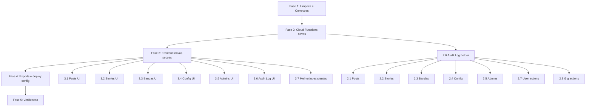

# Plano: Painel Admin Mube — Consolidacao e Evolucao Robusta

## Contexto

O Mube ja possui um painel admin funcional em `landing_page/admin/` (3 arquivos: index.html, app.js, styles.css) servido via Firebase Hosting em `/admin`. O backend em `functions/src/admin.ts` (~2657 linhas) expoe 27 Cloud Functions protegidas por `assertAdmin()` (custom claim `admin=true`). Existe tambem um diretorio `admin_panel/` **obsoleto** com uma versao anterior do painel que nunca e deployada (firebase.json aponta `public: "landing_page"`).

O painel atual cobre 10 secoes: Dashboard, Usuarios, Conversas, Gigs, MatchPoint, Destaques, Denuncias, Suspensoes, Tickets e Sistema (com Firestore/Storage explorers). Funciona em desktop e mobile (sidebar responsiva com scrim). Porem existem lacunas funcionais e problemas de robustez que precisam ser resolvidos para administrar **tudo** no app.

### Problema

O painel precisa evoluir para cobrir areas nao atendidas (posts/stories, bandas, config do app, gestao de admins, audit log) e corrigir bugs/fragilidades no codigo existente, mantendo compatibilidade desktop/mobile e zero bugs.

## Arquitetura

```
┌──────────────────────────────────────────────────────────┐
│  Admin (Browser - Desktop ou Mobile)                     │
│  landing_page/admin/ (HTML + CSS + Vanilla JS)           │
│  Firebase Hosting: /admin → /admin/index.html            │
└──────────────┬───────────────────────────────────────────┘
               │ Firebase Auth (email/password)
               │ Custom Claim: admin=true
               ▼
┌──────────────────────────────────────────────────────────┐
│  Cloud Functions (functions/src/admin.ts)                 │
│  onCall + assertAdmin() em cada funcao                   │
│  Regioes: southamerica-east1 (principal)                 │
│           us-central1 (gigs, matchpoint, system)         │
└──────┬──────────┬───────────┬────────────────────────────┘
       │          │           │
       ▼          ▼           ▼
   Firestore   Auth SDK   Storage
   (users,     (getUser,  (buckets
    gigs,       claims,    de media)
    reports,    disable)
    config...)
```

## Secoes existentes vs. lacunas

| Secao           | Status   | O que falta                                                 |
|-----------------|----------|-------------------------------------------------------------|
| Dashboard       | OK       | Resiliencia a falhas parciais (Promise.allSettled)           |
| Usuarios        | OK       | Acoes: editar status, desabilitar auth, resetar contadores  |
| Conversas       | OK       | Nenhuma lacuna critica                                      |
| Gigs            | OK       | Acao: cancelar/fechar gig pelo admin                        |
| MatchPoint      | OK       | Nenhuma lacuna critica                                      |
| Destaques       | OK       | Nenhuma lacuna critica                                      |
| Denuncias       | OK       | Nenhuma lacuna critica                                      |
| Suspensoes      | OK       | Nenhuma lacuna critica                                      |
| Tickets         | OK       | Paginacao (load-more) para filas grandes                    |
| Sistema         | OK       | Nenhuma lacuna critica                                      |
| **Posts**       | AUSENTE  | Listar, moderar (ocultar/remover), ver denuncias            |
| **Stories**     | AUSENTE  | Listar ativas/expiradas, remover, ver views                 |
| **Bandas**      | AUSENTE  | Listar bandas, membros, convites, desativar                 |
| **Config App**  | AUSENTE  | Editor visual de config/app_data (generos, instrumentos)    |
| **Admins**      | AUSENTE  | Listar admins, adicionar/remover claim, historico            |
| **Audit Log**   | AUSENTE  | Registro de acoes admin (quem fez o que, quando)            |

## Plano de Execucao

### Fase 1 — Limpeza e Correcoes (pre-requisito)

**1.1 Remover `admin_panel/` obsoleto**
- Deletar `admin_panel/` inteiro (3 arquivos: index.html, app.js, styles.css)
- Ele nunca e deployado; `landing_page/admin/` e a versao canonica

**1.2 Corrigir bug de resiliencia no Dashboard**
- Arquivo: `landing_page/admin/app.js`, funcao `loadDashboard` (~linha 386)
- Problema: `Promise.all([getDashboardOverview, getMatchpointRankingAuditDashboard])` — se uma falhar, ambas falham
- Correcao: trocar por `Promise.allSettled` e renderizar parcialmente com dados disponiveis

**1.3 Corrigir default de listReports no backend**
- Arquivo: `functions/src/admin.ts`, `listReports` (~linha 1227)
- Problema: `const status = (request.data?.status as string) || "processed"` — default deveria ser `"all"` ou `"pending"`, nao `"processed"`
- Correcao: mudar para `|| "all"`

**1.4 Adicionar meta CSP no index.html**
- Arquivo: `landing_page/admin/index.html`
- Adicionar tag `<meta http-equiv="Content-Security-Policy">` com politica restritiva (scripts apenas do proprio host e firebase CDNs, sem inline exceto hashes)
- Nota: o painel usa `innerHTML` extensivamente com `escapeHtml()` — validar que nenhum caminho permite bypass

### Fase 2 — Novas Cloud Functions (Backend)

Todas em `functions/src/admin.ts`, protegidas por `assertAdmin()`.

**2.1 Posts — moderacao**
```
listPostsAdmin({ limit, status, search }) → { posts[], total }
updatePostAdmin({ postId, hidden, hiddenReason }) → { success }
deletePostAdmin({ postId }) → { success }
```
- Ler de `posts` collection, enriquecer com autor (users)
- `updatePostAdmin` seta campos `hidden`, `hidden_reason` (protegidos por firestore rules contra client)
- `deletePostAdmin` remove o documento

**2.2 Stories — moderacao**
```
listStoriesAdmin({ limit, status, ownerUid }) → { stories[], total }
deleteStoryAdmin({ storyId }) → { success }
getStoryAdminDetail({ storyId }) → { story, views[], owner }
```
- Ler de `stories` collection, enriquecer com owner
- `deleteStoryAdmin` remove story + subcollection views

**2.3 Bandas — gestao**
```
listBandsAdmin({ limit, search }) → { bands[], total }
getBandAdminDetail({ bandId }) → { band, members[], invites[] }
```
- Ler de `bands`, `bandMemberships`, `invites` (filtrado por band_id)

**2.4 Config App — edicao**
```
getAppConfig() → { data }
updateAppConfig({ path, value }) → { success }
```
- Ler/escrever `config/app_data` (generos, instrumentos, etc.)
- `updateAppConfig` usa merge parcial para editar campos especificos

**2.5 Gestao de Admins**
```
listAdmins() → { admins[] }
removeAdminClaim({ uid }) → { success }
```
- `listAdmins`: le `config/admin.adminUids`, busca auth record de cada UID
- `removeAdminClaim`: remove custom claim + remove UID do array (impedir self-removal)

**2.6 Audit Log**
```
logAdminAction(action, targetId, details) — helper interno (nao exportado)
getAdminAuditLog({ limit }) → { entries[] }
```
- Criar collection `adminAuditLog` no Firestore
- Helper `logAdminAction` chamado dentro de funcoes mutantes (manageSuspension, updateReportStatus, updateTicket, setFeaturedProfiles, etc.)
- `getAdminAuditLog` le com orderBy `timestamp` desc

**2.7 Acoes de usuario expandidas**
```
updateUserAdmin({ uid, status?, authDisabled? }) → { success }
```
- Permite forcar status do usuario, desabilitar auth, etc.
- Registra no audit log

**2.8 Acoes de gig expandidas**
```
updateGigAdmin({ gigId, status }) → { success }
```
- Permite fechar/cancelar gig pelo admin

### Fase 3 — Frontend (Novas Secoes no Painel)

Todos os arquivos em `landing_page/admin/`.

**3.1 Secao Posts (index.html + app.js)**
- Nav item no sidebar grupo "Gestao": icon `article`, label "Posts"
- Toolbar com busca e filtro de status (all / visible / hidden)
- Lista de cards com titulo, autor, data, badges (status, hidden)
- Acoes: "Ocultar", "Remover", "Ver usuario"
- Usa `listPostsAdmin`, `updatePostAdmin`, `deletePostAdmin`

**3.2 Secao Stories (index.html + app.js)**
- Nav item no sidebar: icon `amp_stories`, label "Stories"
- Lista com owner, status (active/expired), created_at, views count
- Acoes: "Remover", "Ver detail (drawer)", "Ver usuario"
- Usa `listStoriesAdmin`, `deleteStoryAdmin`, `getStoryAdminDetail`

**3.3 Secao Bandas (index.html + app.js)**
- Nav item no sidebar grupo "Operacao": icon `groups_3`, label "Bandas"
- Lista com nome, membros count, convites pendentes
- Detail panel (split layout): membros, convites, dados da banda
- Usa `listBandsAdmin`, `getBandAdminDetail`

**3.4 Secao Config (index.html + app.js)**
- Nav item no sidebar grupo "Gestao": icon `settings`, label "Config App"
- Exibe campos de `config/app_data` em formato editavel (key-value com inputs)
- Botao "Salvar alteracoes" que chama `updateAppConfig`
- Usa `getAppConfig`, `updateAppConfig`

**3.5 Secao Admins (index.html + app.js)**
- Nav item no sidebar grupo "Gestao": icon `admin_panel_settings`, label "Admins"
- Lista de admins com email, UID, ultimo login
- Botao "Adicionar admin" (input email + chamar `setAdminClaim`)
- Botao "Remover" em cada admin (com confirmacao)
- Usa `listAdmins`, `setAdminClaim`, `removeAdminClaim`

**3.6 Secao Audit Log (index.html + app.js)**
- Nav item no sidebar: icon `history`, label "Audit Log"
- Tabela cronologica: data, admin, acao, target, detalhes
- Usa `getAdminAuditLog`

**3.7 Melhorias em secoes existentes**
- **Usuarios**: adicionar botoes "Editar status" e "Desabilitar auth" no drawer de detalhe
- **Gigs**: adicionar botao "Cancelar gig" no detail panel
- **Tickets**: adicionar botao "Carregar mais" com paginacao

### Fase 4 — Registrar exportacoes e deploy

**4.1 Exportar novas funcoes em `functions/src/index.ts`**
- Adicionar todas as novas funcoes ao bloco de export do admin

**4.2 Atualizar `FUNCTION_REGIONS` no app.js**
- Mapear novas funcoes para a regiao correta (defaulting to southamerica-east1)

**4.3 Atualizar sidebar navigation no index.html**
- Reordenar sidebar com os novos items nos grupos corretos

### Fase 5 — Verificacao

**5.1 Testar localmente**
```bash
# Compilar functions
cd functions && npm run build

# Verificar lint
cd functions && npx eslint src/admin.ts

# Verificar HTML/CSS/JS (manual review)
# Abrir landing_page/admin/index.html no browser com emulador Firebase
```

**5.2 Testar funcionalidade no browser**
- Login com conta admin
- Navegar por TODAS as 16 secoes (10 existentes + 6 novas)
- Testar busca, filtros, paginacao, drawer de detalhes
- Testar acoes mutantes: suspender, levantar, processar report, salvar destaques
- Testar novas acoes: ocultar post, remover story, editar config, add/remove admin
- Testar em viewport mobile (< 768px) — sidebar abre/fecha, drawer funcional
- Verificar audit log registra acoes

**5.3 Testar resiliencia**
- Verificar que dashboard carrega parcialmente se uma funcao falhar
- Verificar que erros de rede mostram toast, nao crasham o painel
- Verificar que funcoes sem permissao retornam erro claro

## Arquivos criticos a modificar

| Arquivo | Tipo de mudanca |
|---------|----------------|
| `admin_panel/` (diretorio inteiro) | DELETAR |
| `functions/src/admin.ts` | Adicionar ~12 novas funcoes + audit helper |
| `functions/src/index.ts` | Exportar novas funcoes |
| `landing_page/admin/index.html` | 6 novas secoes HTML + CSP + nav items |
| `landing_page/admin/app.js` | 6 novos loaders/renderers + correcoes |
| `landing_page/admin/styles.css` | Estilos para novas secoes (reuso extenso dos existentes) |

## Ordem de implementacao



O audit log helper (2.6) e pre-requisito de todas as funcoes mutantes, pois cada acao admin deve ser registrada. As funcoes de backend e frontend de cada modulo sao independentes entre si e podem ser implementadas em qualquer ordem, desde que o audit helper exista antes.
